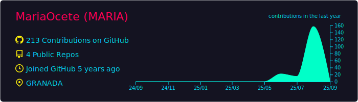
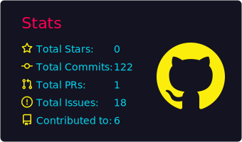

# [María Ocete](https://mariaocete.com/)

  <!-- Frontend -->
  
  
  
  
  <!-- Backend -->
  
  
  
  
  
  
  <!-- DB & DevOps -->
  
  
  
  

---

## GitHub Stats

> Note: I hide “Top Languages” because it doesn’t reflect private work accurately.  
> For real code samples, check the featured projects below. 👇

---

## Featured Projects

- **[Personal Portfolio](https://github.com/MariaOcete/Portfolio-readme)**  
  Bilingual website developed with React and Tailwind, deployed on Vercel with a custom domain. Includes a Django backend for handling contact forms with reCAPTCHA and IP restriction.  

- **[Clinic Management App](https://github.com/MariaOcete/clinics-app)**  (In progress)  
  Multi-role platform (admin, clinician, patient) for managing appointments, billing, and medical records. Built with React, Django REST, and PostgreSQL. Features JWT authentication and encrypted file uploads.  

- **[English Learning App](https://github.com/MariaOcete/english_web-readme/blob/main/README.md)**  
  Educational platform with teacher/student roles, placement test, and assignment management. Developed with Java, Spring Boot, and MySQL.  

- **[Tasklist](https://github.com/MariaOcete/TaskList)**  
  My first project with **Angular**, built during my training.  
  Task management application with CRUD functionalities (create, read, update, delete).  
  I also explored using **Symfony/PHP** for the backend and deployment with **Docker Compose**.  

- **Invoice App (CodeArts Solutions)**  
  Development of a complete invoicing and client management system with **Angular (frontend)** and **Symfony/PHP (backend)**, using **PostgreSQL** and deployed with **Docker**.  
  My main contribution was the implementation of the **Admin Dashboard**, which included monthly and quarterly metrics for revenue, invoices, and manager statistics.  
  I also developed the **secure authentication system with Access and Refresh Tokens (HttpOnly cookies)**, improving both security and user experience.  
  *(not public due to confidentiality)*  

---

## How I Work

- **Security**: JWT with HttpOnly refresh cookies, strict CORS, input sanitization, CSRF where applicable.  
- **Quality**: unit/integration tests, PR reviews, style conventions, solid documentation.  
- **DevOps**: CI with GitHub Actions, deployments to Vercel/Render, basic logs/monitoring.  
- **UX/Accessibility**: i18n, responsive design, color contrast & keyboard navigation.

---

## Tech Summary

**Frontend**: React, Angular, Tailwind, HTML5, CSS3, JavaScript (ES6+).  
**Backend**: Django REST, Spring Boot/Java, Symfony/PHP, Python.  
**Databases**: PostgreSQL, MySQL.  
**Infra/DevOps**: Docker, Vercel, Render, GitHub Actions.  
**Security**: JWT (HttpOnly), reCAPTCHA, CORS, IP restriction.  
**Tools**: Git/GitHub, Postman, VS Code, Eclipse, Agile.

---

## Contact

- 🌐 Portfolio: **[mariaocete.com](https://mariaocete.com/)**
- ✉️ Email: **mariaocete93@gmail.com**
- 🔗 LinkedIn: **[linkedin.com/in/maria-ocete-martin](https://www.linkedin.com/in/maria-ocete-martin/)**

